# Space and Engineering Academy Senior Project
## Hurdle Carts
##### [Prefer a slideshow?](Slideshow.md)   
My team members:
- Qudsi Aljabiri
- Brandon Lindner
- Wentinn Liao
- Pranav Banuru

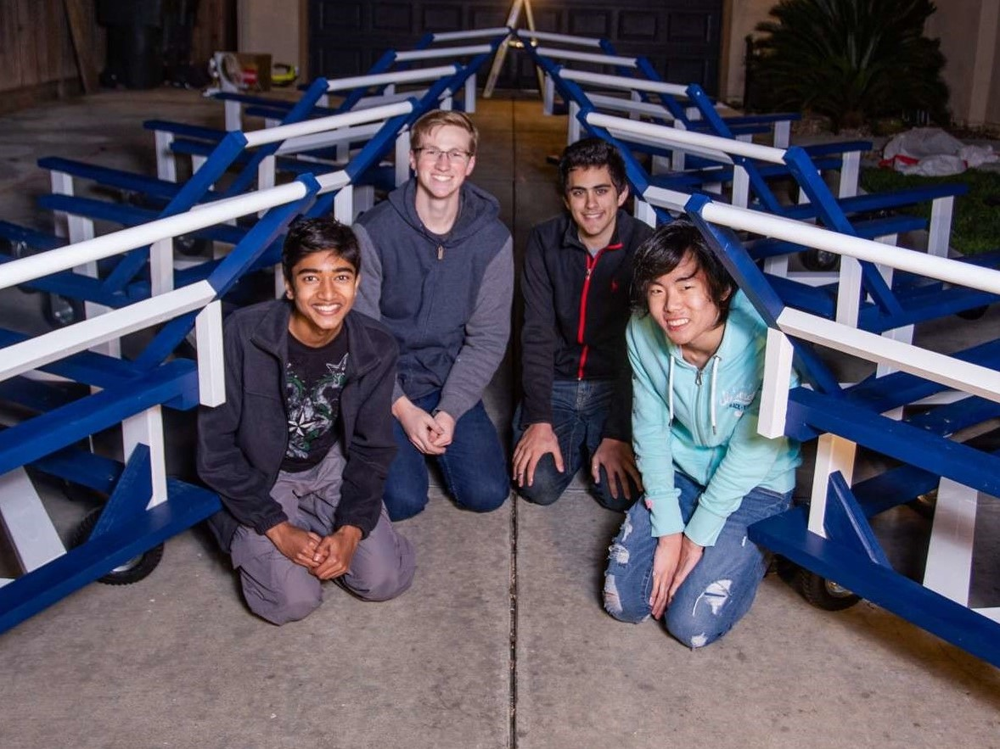
  

Jump:  
[Project Concept](#project-concept)  
[Target Organization/Goal](#our-target-organization-and-goal)   
[Raw Materials/Costs](#raw-materials-costs)   
[Full Materials/Costs](#full-materials-costs)   
[Project Details](#details)   
[CREO Drawing](#creo-drawing)    
[Brainstorming](#brainstorming)   
[CREO vs Reality Comparison](#comparison)   
[Prototyping](#progression--prototyping)   
[First Batch of Wood](#first-batch-of-wood)   
[Measuring and Cutting Wood](#progression--measuring-and-cutting-wood)   
[Sanding and Staining](#progression--sanding-and-staining)   
[Construction](#progression--construction)   
[Putty &rarr; Re-Stain](#putty--re-stain)   
[Touching Up / Bedliner](#progression--touching-up--bedliner)   
[Touching Up → Bolt Grinding](#touching-up--bolt-grinding)   
[Storage](#storage)   
[Hours Spent](#hours-spent)   
[Delivery](#delivery)   
[What we improved and why](#what-we-improved-and-why)   
[Advice / Recommendations](#advice--recommendations)   
[Impact](#impact)   
[Group Picture](#Picture!-📸)

Pictures:

 
 

# Project Concept:

- Make carrying & transporting hurdles easier.
- Make setup and removal of hurdles faster.

   - as hurdles are made of metal and come in large numbers.
- Each cart holds 8 Hurdles, 10 Carts, for 80 hurdles used in races.
- General design was found online but modified for a wood build.
  
  

# Our Target Organization and Goal
- For Merrill F. West High School Track & Field Team
  - for the hurdlers and the rest of the team for tightly scheduled meets.
- To make transporting hurdles much easier and faster  
   (setting up hurdles by hand is a tedious process)
- To be stored under WHS bleachers.
  
  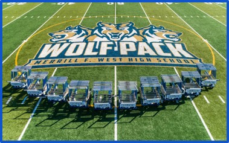 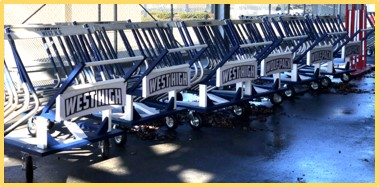 
  
# Raw Materials Costs
Cost of everything that is physically part of the hurdle.  
This excludes items such as blue tape and sandpaper, among others.

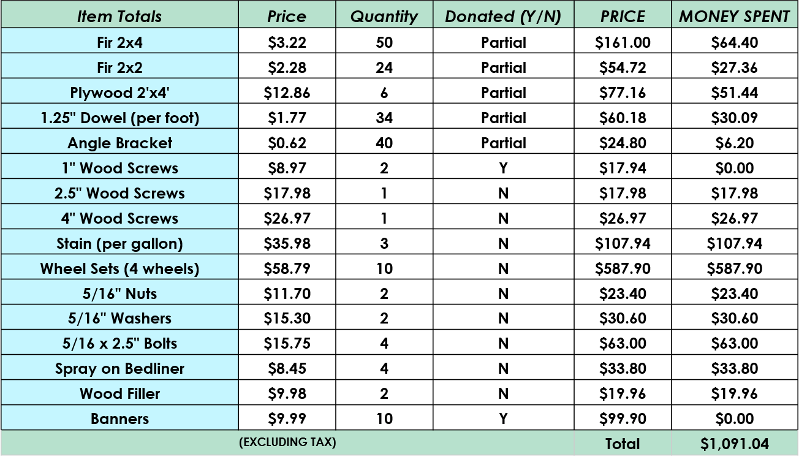
 
~ $1091 for 10 hurdle carts or ~$109 per cart.  
Fairly accurate estimate, but it depends on the amount of wood filler used to smooth out the wood per cart.

# Full Materials Costs

Total cost:  
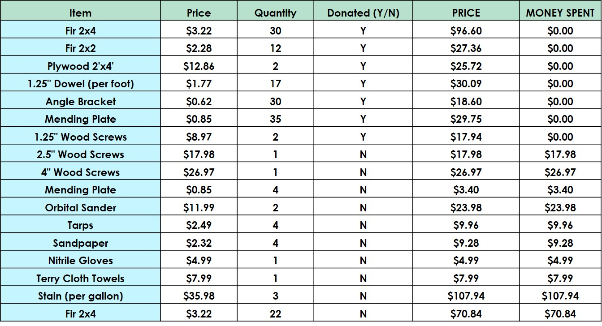  
continued:  
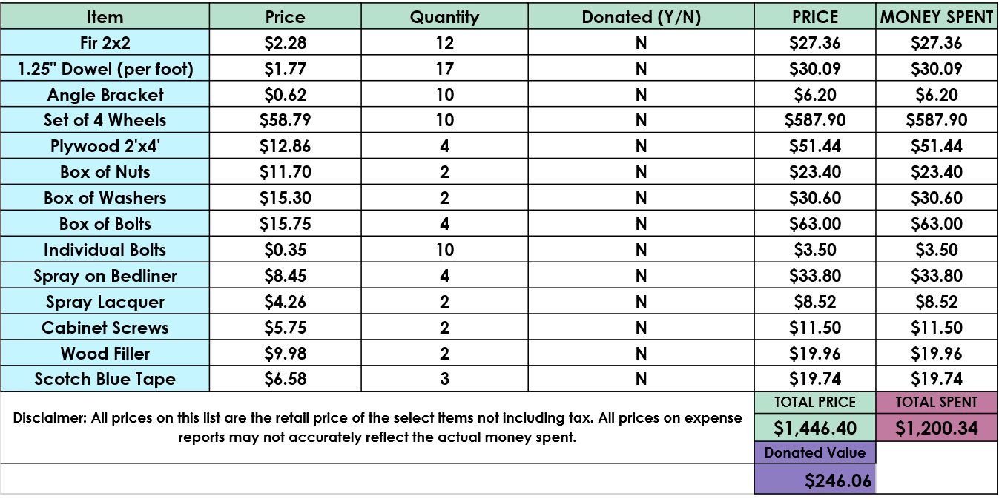

In total, this project would have costed us ~$1450 without donations, which we are very thankful for.

The price us four put in, in total, was $1200.

# Funding/Spending

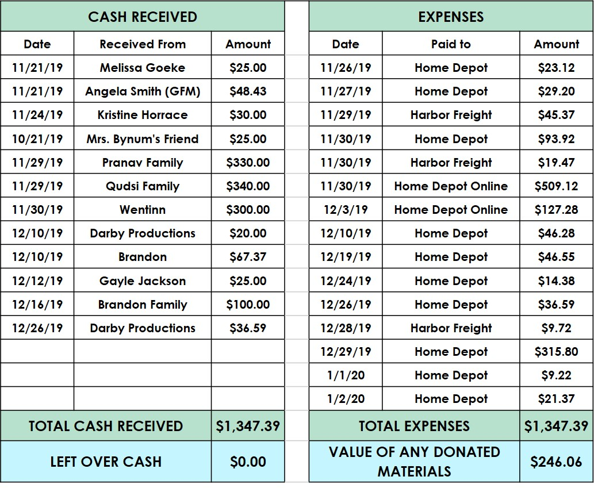

# Details
## Some of these will make more sense later on.

- 9/64’ bit used for pilot hole, countersink and wood boring bit for 4’ and 2.5’ wood screws
  
- Perpendicular cuts made with a circular (Milter) saw, but diagonal cuts were done manually for accuracy
  
- All wood parts except for the two primary layers were sanded and stained before construction
  
    - Two layers were sanded, built, then stained as a whole
    - Heaters and fans used to speed up drying  
    
- Putty used to cover the drill holes, then sanded and repainted
- Entire wood frame, excluding the handle and handle braces built before adding wheels
- Two wood beams added, a horizontal to brace the handle beams and another to support plywood
- Metal angle braces drilled to align the white vertical supports  
  
- Initially, the Wolfpack and West High stickers were printed then lacquered onto the plywood
    - Lacquer produced a brown tint after drying, so we replaced the plywood with banners.
    - Banners were printed and drilled onto the plywood
    - Easily replaceable and more resistant to damages, ie. water and scratching  
    
- Bedliner sprayed on the bottom layer to prevent scratches from the hurdle edges
- Bolts holding the swiveling tires were ground with an angle grinder to prevent hitting the axle
- Touching up included puttying rough surfaces, sanding and repainting, and cleaning

# CREO Drawing
Prior to building, we created 3D models of our cart design for planning.   

At the time, I was at science camp, so I fully owe my teammates for this art.

Having a sort of map helped us build successfully.

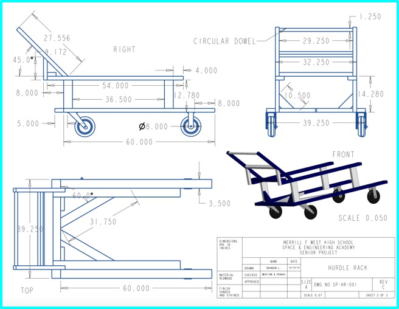

# Brainstorming

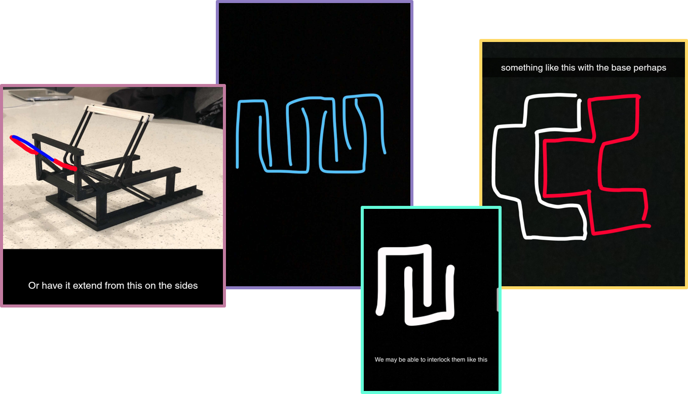

When not meeting in real life, we communicated primarily through Snapchat.

Here, we used Snapchat's drawing feature to plan.  

  **Example Question:** How to make the handle easier to move and store compactly.

# Comparison
## CREO (Version 49) --> Real
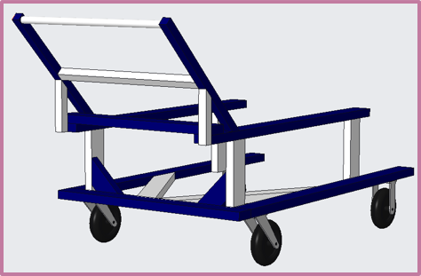

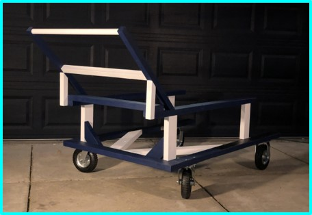

# Progression ~ Prototyping

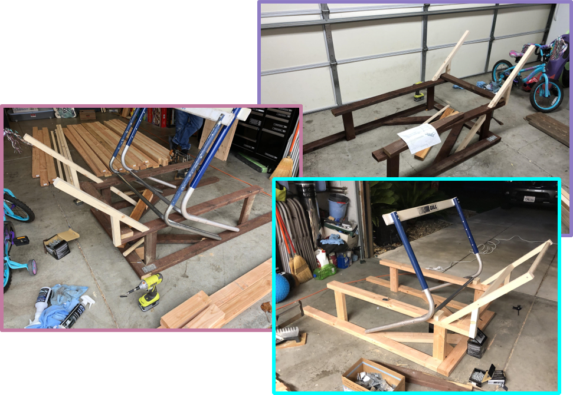

## Purpose of a prototype
- Ensure accuracy of measurements
- Test structural integrity
- Check functionality (can it fit hurdles)
- Save "good" wood
- Be prepared for difficulties

# First Batch of Wood

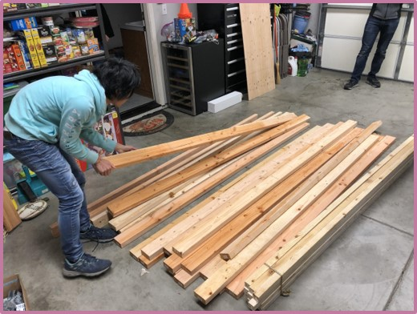

We made two separate trips to Home Depot in order to minimize waste in case of changes.

This wood, along with a few other supplies, was graciously donated by Home Depot, saving us roughly $250.

We left the wood to dry in Brandon's garage for one week. Home depot sells their wood freshly cut, meaning it is still wet.   
Wood shrinks after drying, so we waited to avoid sizing inaccuracies.

# Progression ~ Measuring and Cutting Wood

- Bottom Layer
  
  - 2 - 2” x 4” x 60”
  - 1 (horizontal brace) - 2” x 4” x 39.25”
- Top layer
  - 2 - 2” x 4” x 54”
  - 1 (horizontal brace) - 2” x 4” x 32.25”
- Vertical supports
  - 4 - 2” x 4” x 12.75”
  - 2 vertical handle braces - 2” x 2” x 9.125”
- Diagonal base supports
  - 2 long diagonals - 2” x 4” x 31.75”
  - 2 short diagonals - 2” x 4” x 10.5”
- Handle
  - 2 diagonal braces - 2” x 2” x 27.5”
  - 1 dowel - 1.25” x 29.25”
- Banner
  - 1 Plywood - 9.125” x 32.25” x 0.25
  - 1 - (horizontal brace) 2” x 2” x 29.25”   
  
  
  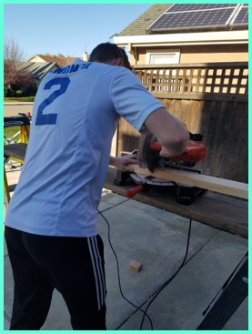
  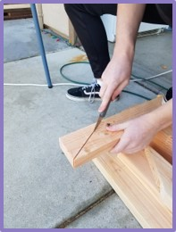

# Progression ~ Sanding and Staining

- All pieces sanded before stain
  
- Navy blue stain
  - Bottom and top layer primary structure
  - Bottom 45 degree diagonal supports
  - Diagonal handle braces
- White stain
  - Vertical supports
  - Bottom 60 degree diagonal braces
  - Handle bar
  - Banner plywood
- Parts stained individually to prevent rot at edges (through water leakage)

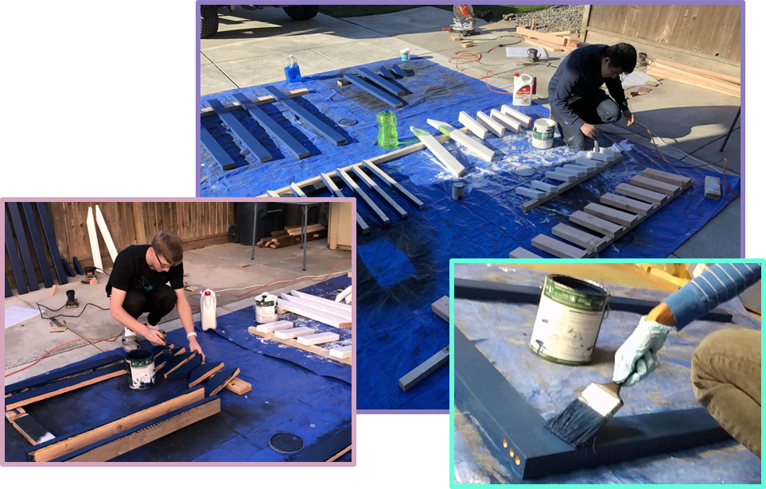

## Continued

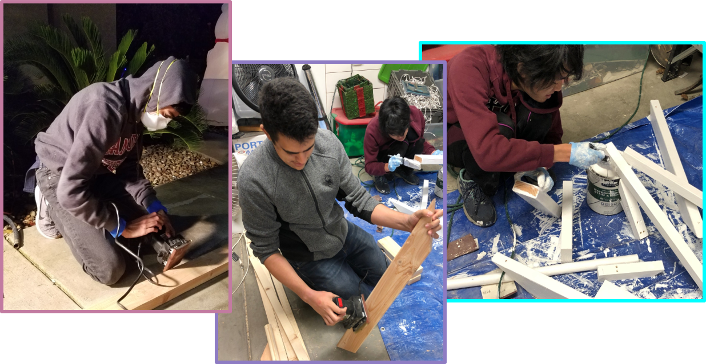

# Progression ~ Construction

- General

  - 9/64” bit for pilot hole
  - Counter sink and wood boring bit
  - 4” and 2.5” wood screws
- Bottom layer
  - Horizontal brace adjacent to lateral beams
  - 4” wood screws through front
  - 60° horizontal support
  - 45° vertical supports
- Top Layer
  - Overlaying butt joint
  - Screwed directly into verticals
- Handle
  - 45° connections
  - Lateral support
  - 1.5” dowel secured with 4” screws
  
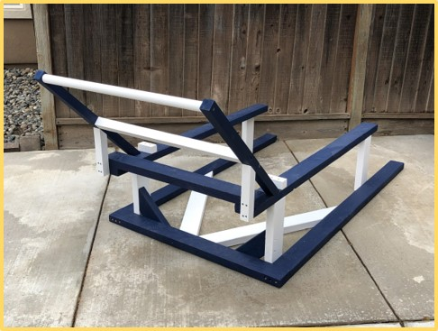

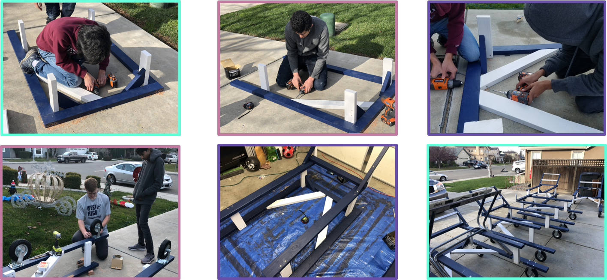

# Putty &rarr; Re-Stain
Puttying rough spots in the wood and covering screws to make a water tight seal.  

 After filling areas, we leave the putty to dry and re-stain with blue or white stain.

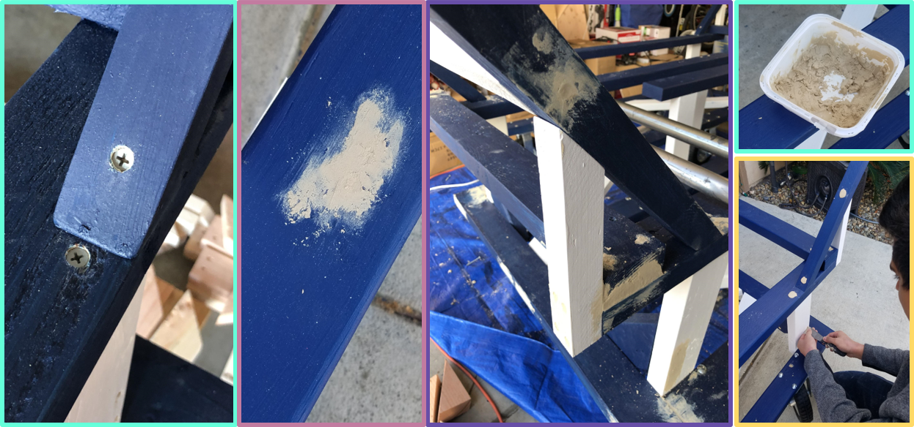

# Progression ~ Touching Up / Bedliner

Truck bedliner was added where the metal hurdle feed contact the cart in order to avoid damage to the wood.

We covered certain areas with carpenters tape and touched up with new stain. 

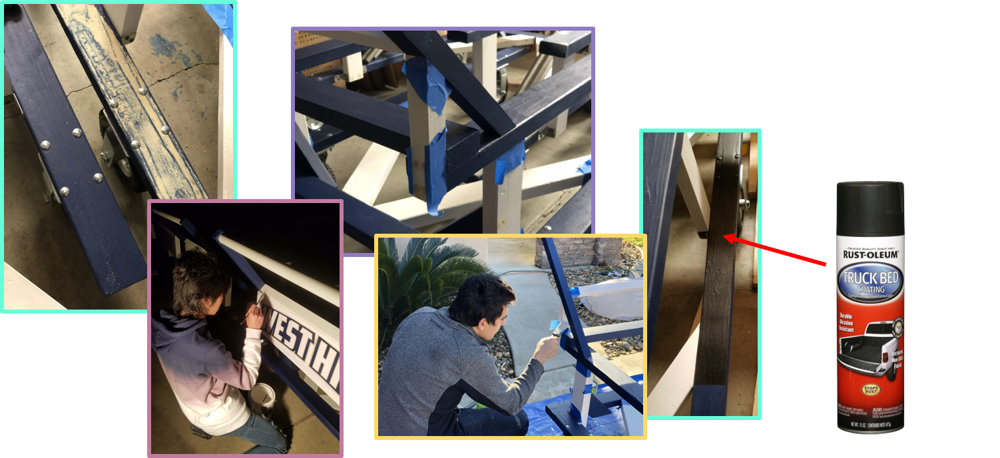

# Touching Up &rarr; Bolt Grinding 

We ran into an issue:  

When we pushed the hurdle cart, the bolt threads holding the wheel in place would collide with the metal swivel arm.

This obstructed motion, so we used an angle grinder to shorten the bolts.

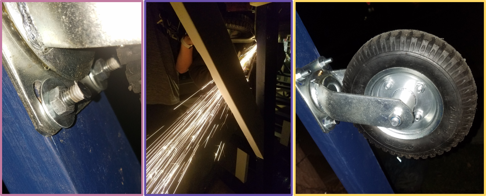

# Storage

We stored these carts by arranging them within eachother.

The storage Location was Brandon's Garage.

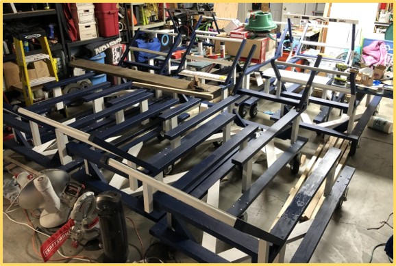

# Hours Spent

Together, we spent approximately **239** hours total working on this project. 

The 239 takes into account when each of us arrived and left each workday.  
 (We kept track)

This table shows our workdays and work hours.

>The time started/ended here refers to when one of us began working or all of us stopped working.

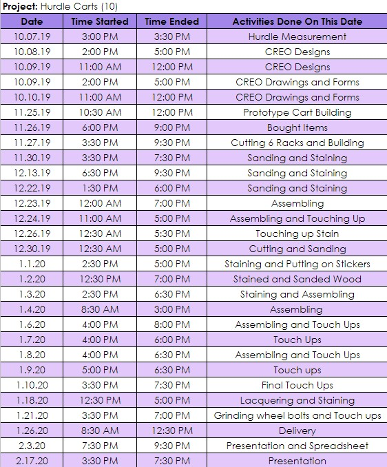

Prep &darr; refers to CREO Designs, prototyping, and other preparation activities, before building our actual carts.

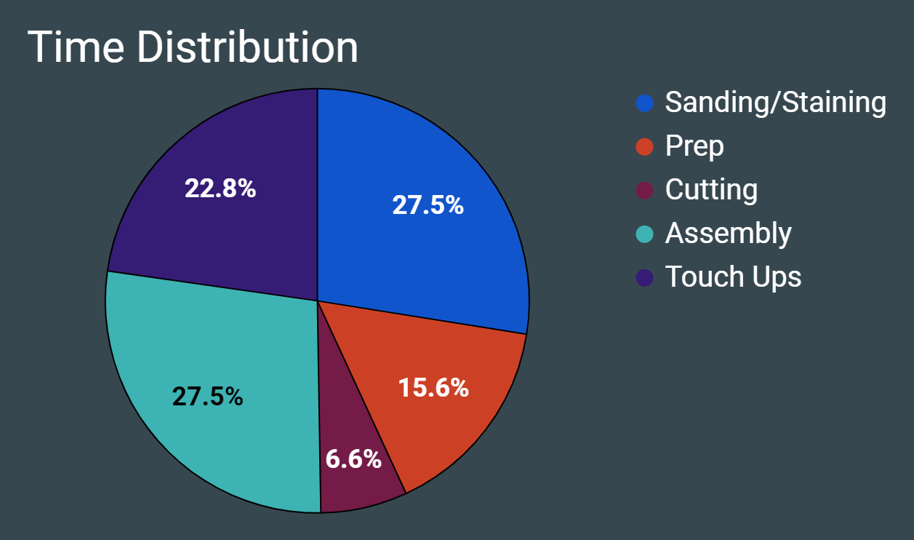

# Delivery

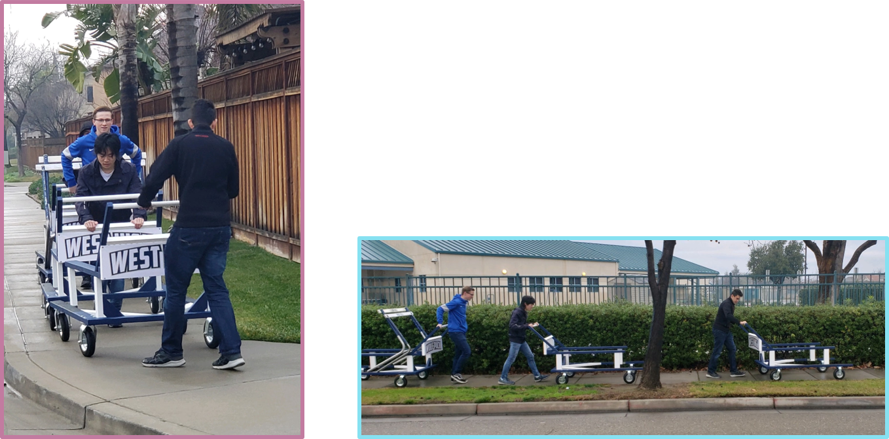

We walked these 10 carts to West high.   
>- Walked to West High
>- Walked back
>- Walked to West High again

West High is about 1.1 miles from Brandon's house, our work location.

This allowed us to test the durability of the carts.

# What we improved and why

### 1. Vertical Handle → Angled Handle
  >- Less stress on the front joint
  >- Easier to pull
  >- Puts user further away from the cart
### 2.  2” x 4” Handle → Dowel
  >- Lesser risk of splinters
  >- Easier to pull
### 3.  Constrain Plate Removal
  >- No noticeable benefit
  >- More cost
  >- Hard to find
### 4. Wood blocks to prevent slipping

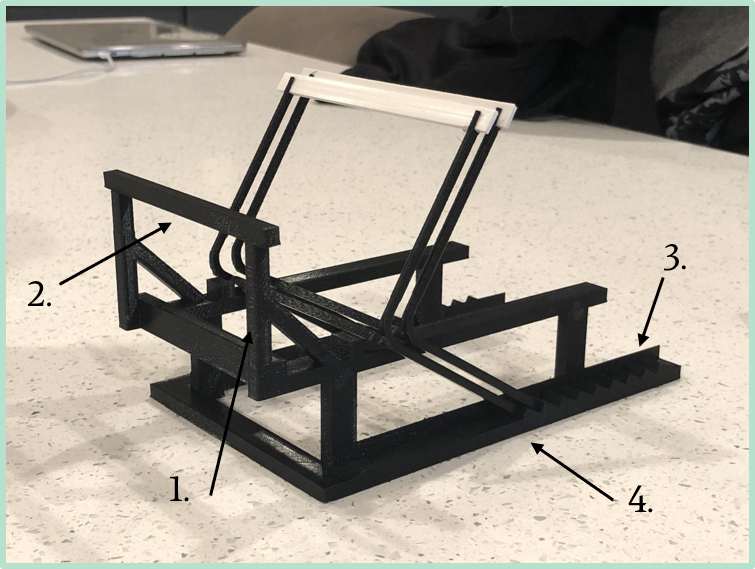

### 5. Banner changes / plywood support

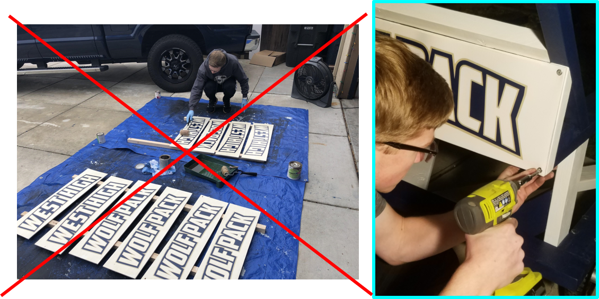

Initially, we used laquer on stickers for our banners. However, the laquer created a yellow tinge, so we chose to use decorated banners on the plywood rather than laquered stickers.

Brandons family has a print shop, so they were able to print banners for us. They are durable, but easily replaceable if needed.

# Advice / Recommendations
### If you are doing a project of your own

- If you have a deadline, start early; because... you should
  - It gives you time for mistakes if they occur.

- Consider actual use conditions
  - Will it rain? Waterproofing?
- Communicate
  - What needs to be done
  - Who *should* do it
  - how it should be done
- Bring warm clothes
  - it can be very cold from November to January
    - especially if it is raining like it did on some days we worked
- Paint in the sunlight
  - Sunlight helps the paint dry much faster.
    - even when cold

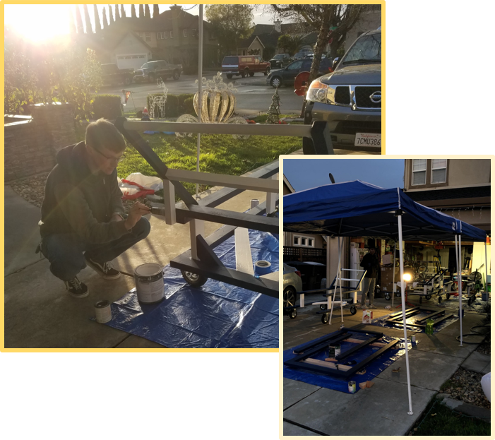  

# Impact

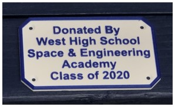

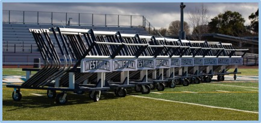

The track team has been using these carts for the past month (since January 27th) and have found them extremely helpful.   

We are really glad our project will continue to have a positive impact.

<video width=130 height=240 controls>
<source src="images/vid.mov"> 
</video>   

Mr. TJ Williams, the Head Coach for WHS Track and Field:
> "This has gotta be the best project ever done by any [SEA] kids"

# Picture! 📸

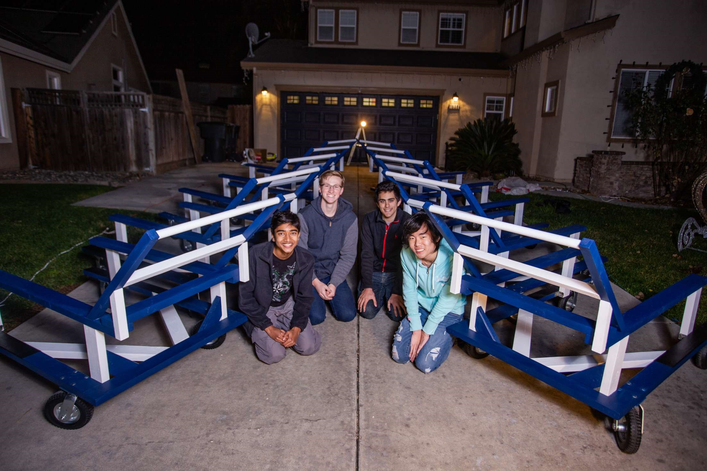

[Return to Top!](#space-and-engineering-academy-senior-project)

