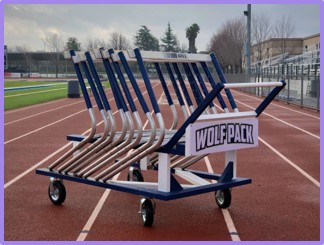
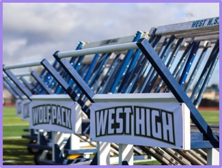
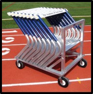
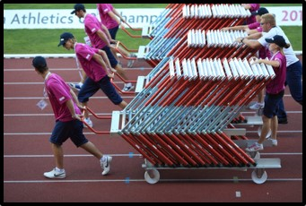

# Space and Engineering Academy Senior Project
## Hurdle Carts
My team members:
- Qudsi Aljabiri
- Wentinn Liao
- Brandon Lindner
- and me, Pranav Banuru

Side Note: This will have some powerpoint slides included due to the nice formatting.

Pictures:

 
 

## Project Concept:

- Make carrying & transporting hurdles easier.
- Make setup and removal of hurdles faster.

   - as hurdles are made of metal and come in large numbers.
- Each cart holds 8 Hurdles, 10 Carts, for 80 hurdles used in races.
- General design was found online but modified for a wood build.
  
   